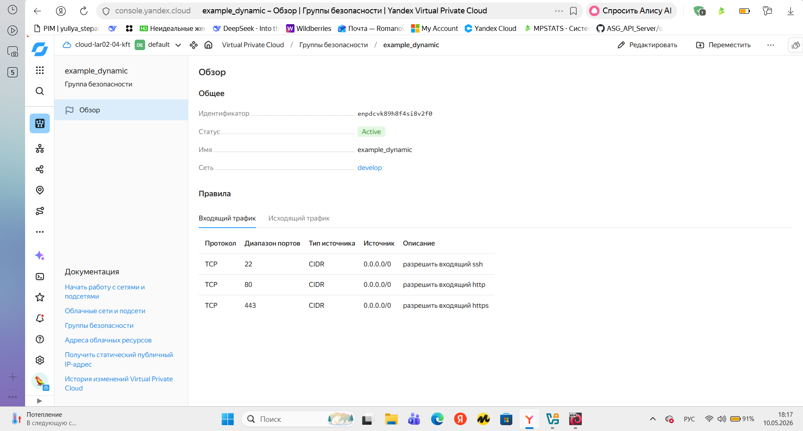
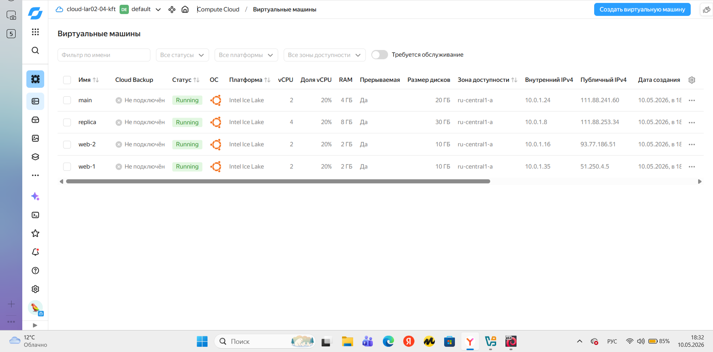
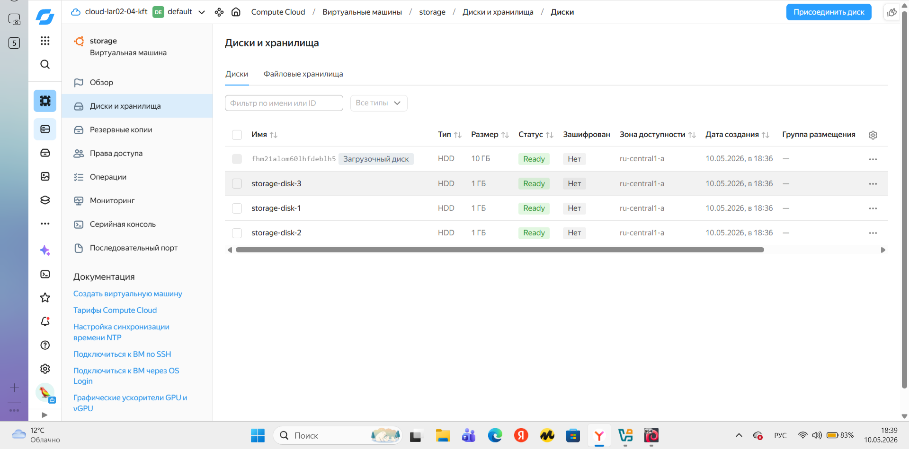
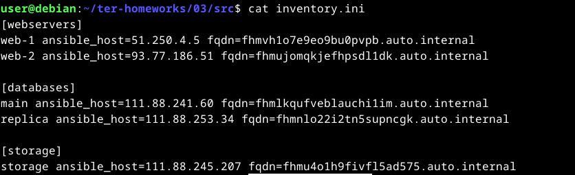

# Домашнее задание к занятию «Управляющие конструкции в коде Terraform»

## Задание 1. Группа безопасности

## Задание 2. Все ВМ (web-1, web-2, main, replica)

## Задание 3. Диски ВМ storage

## Задание 4. Inventory файл

## Проект включает файлы:
- `count-vm.tf` — создание web-серверов через count
- `for_each-vm.tf` — создание БД через for_each
- `disk_vm.tf` — диски и ВМ storage
- `ansible.tf` — генерация inventory через templatefile
- `security.tf` — группа безопасности с dynamic блоками
- `locals.tf`, `outputs.tf`, `variables.tf`, `providers.tf`, `versions.tf`

Все задания выполнены, код проходит `terraform plan` без ошибок.
